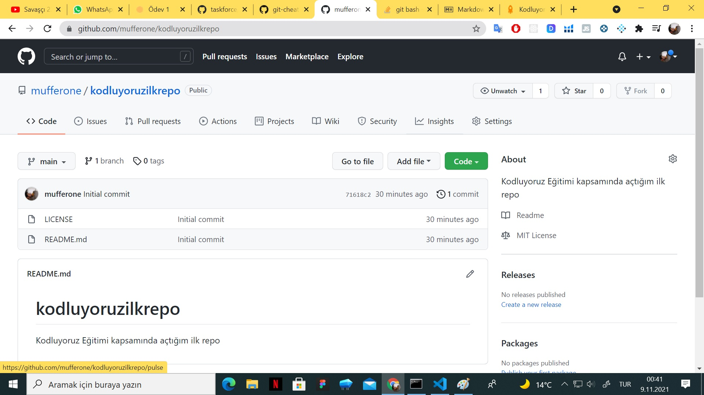

# Kodluyoruz Ilk Repo

Bu repo [Kodluyoruz](https://www.kodluyoruz.org/) Front-End Eğitiminde oluşturduğumuz ilk repo. İçerisinde bir adet README dosyası, bir adet de index.html barındırıyor.

## Installatıon

Öncelikle projeyi clonelayın.

    git clone https://github.com/mufferone/kodluyoruzilkrepo.git

## Usage

Projeyi cloneladıktan sonra Vİsiual Studio Code programında açınız.

Linux için;

    cd kodluyoruzilkrepo
    code .

## Contributing

Pull requestler kabul edilir. Büyük değişiklikler için, lütfen önce neyi değiştirmek istediğinizi tarışmak için bir konu açınız.

## Licence

[MIT](https://github.com/mufferone/kodluyoruzilkrepo/blob/main/LICENSE)

